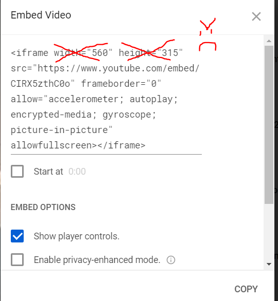
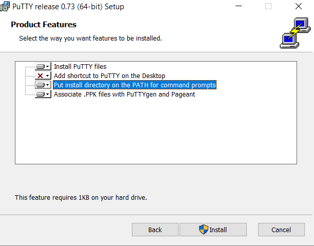

# Editing the Website
<i>By Hiro Kakitani</i>  
This guide is intended for anyone maintaining the site that might not have any experience with web development. If you know what you're doing, then you probably don't need to read this :) 
  - [Setup](#setup)
    - [Getting the Source code](#getting-the-source-code)
    - [Getting a Text Editor](#getting-a-text-editor)
  - [Folder Structure](#folder-structure)
    - [Opening the Code in the Editor](#opening-the-code-in-the-editor)
    - [Files](#files)
      - [HTML Files](#html-files)
      - [Images](#images)
  - [Making Changes](#making-changes)
    - [Using VS Code](#using-vs-code)
    - [Basics](#basics)
      - [Basic HTML](#basic-html)
      - [Changing Text](#changing-text)
      - [Changing Images](#changing-images)
    - [Editing Each Page](#editing-each-page)
      - [Stuff to Not Touch](#stuff-to-not-touch)
      - [index.html (Home Page)](#indexhtml-home-page)
      - [about.html (About Page)](#abouthtml-about-page)
      - [gallery.html (Image Gallery)](#galleryhtml-image-gallery)
      - [media.html (Collection of Videos)](#mediahtml-collection-of-videos)
      - [roster.html (Roster Page)](#rosterhtml-roster-page)
      - [booking.html (Contact Page)](#bookinghtml-contact-page)
      - [concert.html (List of Past Concerts)](#concerthtml-list-of-past-concerts)
      - [history.html (Taiko History Page)](#historyhtml-taiko-history-page)
      - [performances.html (Upcoming Gig Calendar)](#performanceshtml-upcoming-gig-calendar)
      - [comingSoon.html (Placeholder Page)](#comingsoonhtml-placeholder-page)
    - [Deploying the Website](#deploying-the-website)

## Setup
Before being able to edit the website, you'll need to do some one-time setup. 
### Getting the Source code
If you don't have a local copy of the website's code already, you can download it <a href="https://github.com/HirotoKakitani/Asayake-website">here</a>. Go to "Clone or download" and click on "Download ZIP".

</img>

Once the download finishes, be sure to unzip the file.  <b>You won't need to do this every time you want to make a change to the website. As long as you keep a copy of these files somewhere on your computer, you should be good.</b>

### Getting a Text Editor
You'll need some kind of code text editor to make any changes to the website. If you don't have one, an easy one to use is <a href="https://code.visualstudio.com/">Visual Studio Code</a>. Go ahead and download the latest stable version. <b>For the rest of this document, I'll assume you're using VS Code. If you're using some other editor, I'll assume you can figure out how to do the things described here.</b>   
After you have installed VS Code, you'll need to install a plugin to make making editing a little easier. Once VS Code is open, click the "Extensions" menu on the left side of the window. There should be a search bar at the top. Search for "Live Server" and install it.

</img>

## Folder Structure
### Opening the Code in the Editor
To start editing the site, go to "File > Open Folder" and select the "Asayake-website" folder. This should open up an explorer panel on the left side showing the contents of the folder.

</img>

### Files
There are a lot of folders and files here, but **the only ones you have to worry about are the ".html" files, and the images in the "res/photos" folder**. Modifying the other files may open up a Pandora's Box of pain and suffering. 

#### HTML Files
Each HTML file corresponds to a page of the website. Here's a break down of each file: 
| File Name       | Description                                   |   |   |   |
|-----------------|-----------------------------------------------|---|---|---|
| index.html      | Home page                                     |   |   |   |
| about.html      | Information about Asa                         |   |   |   |
| gallery.html    | Image gallery                                 |   |   |   |
| media.html      | Collection of videos                          |   |   |   |
| roster.html     | Current Asa members                           |   |   |   |
| booking.html    | Contact information                           |   |   |   |
| history.html    | Taiko history page                            |   |   |   |
| performances.html | Google calendar of upcoming gigs            |   |   |   |
| concert.html    | Concert information                           |   |   |   |
| comingSoon.html | Placeholder for pages I haven't made yet lol  |   |   |   |

#### Images
If you want to add/change any of the images, add them to the "res/photos" folder. More specific instructions for changing images can be found <a href="#changing-images">here</a>.

## Making Changes 
### Using VS Code
Once you have the <a href="#opening-the-code-in-the-editor">"Asayake-website" folder open</a> in VS Code, click on the <a href="#html-files">corresponding html file</a> for the page you want to edit in the explorer panel on the left. You should see that page's source code open up in the editor. 

</img>

Now that you have the source code open, you'll probably want to see how the page will actually look in a browser. This is where the Live Server plugin comes into play. Live Server lets you preview what the page will look like in a web browser. On the bottom right corner, there should be a button that says "Go Live". If you don't see it, make sure you have installed the <a href="#getting-a-text-editor">Live Server plugin</a>. 

</img>

This should automatically open up your default browser to display the opened HTML file. **It's recommended that you use Google Chrome or Firefox when making any changes.**

If it doesn't automatically open up your browser, open your browser and go to http://127.0.0.1:5500/.

Whenever you save any changes to a page's html file, Live Server will automatically reload the preview of the page to reflect the new changes. 

### Basics
If you're interested in it, here's a quick crash course of basic HTML concepts that'll be helpful when maintaining the website. 

#### Basic HTML
HTML is a way to structure elements on to a web page. Basically, every image, paragraph of text, button, or any other "thing" you see on web site is an element. When looking at the HTML, you might notice a bunch of brackets like this: "\<div\>". Every element on a web page is defined by these brackets. For example, on the index.html page, you'll see an "h1" tag like this:

</img>

The "\<h1\>" tag defines a header on the web page. Elements begin with an opening tag ("\<h1\>"), end with a closing tag ("\<\/h1\>"), and the content of the elements are found in between (The text "Asayake Taiko"). Closing tags will always have a forward slash "/" before the element name. The names of the opening tags and the closing tags must match, or else it won't be valid HTML.

You can also embed some additional information about the element in the opening tag. In index.html, you'll see a bunch of "img" tags that look like this: 

</img>

"src" and "alt" are being assigned values in the opening tag. These are called attributes- they further specify things about an element. For example, defining just an "img" tag like this: 

\\</img\>

won't display anything. That's because img tags require at least a "src" attribute to specify what image to display. In the above example, the image being displayed is found in the file "../res/photos/carousel_12.jpg". The "alt" attribute just specifies text that will be shown in place of the image in the case that the image doesn't load properly. 

#### Changing Text
One of the changes you'll be making is editing the text on the website. The majority of the text you'll be editing will be found in \<p\> tags (stands for paragraph). Changing the text is as simple as modifying the contents of the \<p\> tag. 

In case you want a line break in the text, just add a \<br\> element. **Writing your text on a separate line in the code will not reflect on the actual page.** 

#### Changing Images
Changing images requires changing the "src" attribute in the img tag, as described in the <a href="#basic-html">Basic HTML</a> portion. First, make sure any images you want to use are in the "/res/photos" folder. Then, create an \ tag (just copy and paste an existing one) and make sure the "src" attribute is set to the image you want to use. If you really want to go the extra mile, then set the "alt" attribute to be some fallback text that will be displayed in case the image doesn't load.  
**BIG IMPORTANT NOTE INCOMING...** 
The src attribute is case sensitive! For consistency's sake I made all of the file extensions for each image lower case. You don't have to do this, but just keep in mind that entering:  
\\</img\> 
 
will NOT work if the image name is "image.PNG" or "Image.png" . 
**...END BIG IMPORTANT NOTE**

**ANOTHER BIG IMPORTANT NOTE INCOMING...** 
When uploading images, be conscious about the image's size. Larger (high resolution) images will be slower to load, especially on smaller devices like phones. This will be super apparent on a page with a lot of images, like the gallery or the roster page. Make sure to resize your images accordingly before using them for the site (if you don't have Photoshop, <a href="https://www.photopea.com/">Photopea</a> is a free alternative that you can use to resize/edit images). For reference, the images in the gallery are about 1280 x 853 each. The roster images are a bit smaller. 
**...END OTHER BIG IMPORTANT NOTE**

### Editing Each Page
Here, I'll explain what to touch and what you probably shouldn't touch, as well as how to make specific changes to each page.

#### Stuff to Not Touch
There are some common lines of code among all of the HTML files that you don't need to worry about. Go to any one of the HTML files and find the \<nav\> tag. Everything within the \<nav\> tag and everything that falls above it, ignore it. No touch. Also find the \<footer\> tag. Ignore everything inside and beneath it. No touchy. 

If you're using VS Code, there's a cool feature where if you click on the little "V" arrow thing next to the line number (left side of the screen), you can collapse everything within that tag. For example: 

</img>

Clicking on the arrow on line 26 will collapse the entirety of the \<nav\> tag, making it look like this: 

</img>

Doing this might be useful for hiding everything that you should ignore. 

#### index.html (Home Page)
The only things you might want to change on the home page are the images in the carousel (the slideshow thing) and image on the four buttons on the bottom portion of the page. 

In both of these cases, all you have to do is modify the img element's attributes. Images in the carousel are found in the \<asayake-carousel\> element. You can add as many as you want, all the images you add here will be shown in a loop, in the order that they are defined in \<asayake-carousel\>. 

In \<asayake-carousel\>, you'll see one image that has an additional attribute "class" set to "active". If you want a particular image to be the first image to show up in the slideshow, set that image's class attribute to active. The slideshow will start on that image, and continue down. **There should only be one image in \<asayake-carousel\> with the class set to active.**

</img>

#### about.html (About Page)
Everything you'll want to change in the about page is found in the \<article\> tag. If all you want to do is change some of the text or images in place, then I've explained how to do that <a href="#changing-text">here</a>. 

If you want to add additional images to the page, or add more text sections to the page, that will require adding more elements to the page. If you have any questions about how to do that, don't hesitate to ask me any questions :)  

The HTML follows the flow of the page. The big group photo at the top of the page is found inside of the \<div\> with the id set to "main-image-cont" (top of \<article\>). 

</img>

The text sections beneath the big group photo are contained within \<section\> elements. Within each \<section\> There is a \<h2\> tag that corresponds with the section title, a \<p\> tag that corresponds with the text inside the section, and potentially an \ tag. 

</img>

#### gallery.html (Image Gallery)
Modifying this page is pretty simple. All you have to do is add (or remove) img elements from the the \<div\> with the id of "grid". It will automatically resize and style the image for you. 

#### media.html (Collection of Videos)
Modifying this page is also pretty simple, you don't even have to write your own HTML! All of the videos are contained in the \<section\> element, where each video is an \<iframe\>. Assuming the video you want to add is hosted on Asa's Youtube, go to that video, and click on the "Share button", and then "Embed". It will give you the HTML for the \<iframe\> you can just copy and paste. 
 **REALLY IMPORTANT: remove the "height" and "width" attributes from the \<iframe\> after pasting it.**   

</img>

#### roster.html (Roster Page)
Everything you want to change in this page is in the \<div\> with the id "member-grid". Inside of "member-grid", there are a bunch of \<asayake-card\> elements. Each one corresponds to an Asa member: 

</img>

As you can see, there are a lot of things that go inside of \<asayake-card\>. 

There are two images: one with the "slot" attribute set to "memberImage" and another with the slot attribute set to "altImage". The "memberImage" corresponds to the main image of the member, and "altImage" corresponds to the funny picture that appears when the user hovers over the main image. All images of the members should be placed in the "res/photos/roster_images" folder.   
The \<span\> corresponds to the name of the member.   
There are four \<p\> elements with the slot attributes "major", "year", "favSong", and "quote", respectively. Each one corresponds to a different entry for the member.  
The easiest way to add new member would be to just copy and paste a previous member's \<asayake-card\> and change the text and image URLs.

#### booking.html (Contact Page)
Unless Asa's email or social media changes, you probably don't need to change this page. But in case it does, all you have to do is change the URL in the "href" attribute of the corresponding \<a\> (anchor) element. 

#### concert.html (List of Past Concerts)
The list of concerts is found in the \<section\> element with the id of "concert-container". Each year is contained in their own \<section\> element with the class "concert-year". 

</img>

To add a concert, just copy and paste one of the \<section\> elements from a previous concert, and change the text and images. There is a folder within /res/photos called "concert-posters" that you can store the concert poster image. The image "mystery_concert.png" is used as a placeholder for upcoming concerts. 

#### history.html (Taiko History Page)
This page is in the same format as the about.html page. Refer <a href="#abouthtml-about-page">above</a>. 

#### performances.html (Upcoming Gig Calendar)
Not much to edit here from the HTML side. Any events that get added to the gigs google calendar should automatically show up here. 

#### comingSoon.html (Placeholder Page)
This page is just a placeholder for unfinished pages. You probably don't need to edit this page. 

## Deploying the Website
After editing the website, it's now time to make you changes public! In order to update the live version of the website, you will need to access the ACS web server and upload your files there. Basic instructions can be found <a href="https://ucsdservicedesk.service-now.com/its?id=kb_article_view&sysparm_article=KB0030548&sys_kb_id=a7d72b1bdbc67bc09736f35aaf961975">here</a>.

### Backing Up Files
Though you don't have to do this, it's <b>strongly</b> recommended that you make a back up of your work by copying the entirety of the Asayake-website folder and saving it in a different folder before you send the files over. That way, if you somehow end up messing up the files on both the web server and in your local folder, you still have a back up of your changes. 

### Uploading Files
#### Windows Specific Instructions  
If you are working on a Windows machine, you will need to first download <a href="https://www.chiark.greenend.org.uk/~sgtatham/putty/latest.html"> PuTTY</a>. When installing PuTTY, make sure the "Put install directory on PATH for command prompts" option is enabled:  
</img>  
<b>End of Windows specific instructions</b>  
To send your files to the ACS web server, you will have to use SCP for Macs, or PSCP for Windows. SCP should be installed by default on Macs, and PSCP is included with PuTTY. 
<ol>
  <li>Open the terminal in VS Code by clicking on "Terminal > New Terminal" in the top menu. A new command line cell should open up at the bottom of the window (it might not necessarily look exactly like the one shown below). </li>
  </img>  

  <li>Check your current directory. On Mac, type "pwd", on Windows type "cd" into the terminal. If the command returns the file path to the Asayake-website folder, you are good to go.
    <ul><li>If you are not in the correct directory, navigate to the Asayake-website directory using the "cd" command. For example, if your Asayake-website is located in "/Users/AsayakeTaiko/Documents/Asayake-website", then the command would be:  
 cd /Users/AsayakeTaiko/Documents/Asayake-website</li></ul></li>
 <li>Once you are in the Asayake-website directory, we can upload your files. On Mac, the command is:   
 scp -r * taiko@acsweb.ucsd.edu:~taiko/public_html  
 and on Windows, the command is:   
 pscp -r * taiko@acsweb.ucsd.edu:"public_html"  
 When working on Windows, the quotes around "public_html" are really important, so make sure you have those.

</li>
</ol>

You will be prompted to enter Asa's ACS account password. After that, the files should be uploaded, and your changes should be reflected in the live website http://acsweb.ucsd.edu/~taiko/. And you're done! 🥳