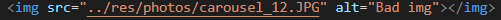

# Editing the Website
<i>By Hiro Kakitani</i>  
This guide is intended for anyone maintaining the site that might not have any experience with web development. If you know what you're doing, then you probably don't need to read this :) 

## Setup
Before being able to edit the website, you'll need to do some one-time setup. 
### Getting the Source code
If you don't have a local copy of the website's code already, you can download it <a href="https://github.com/HirotoKakitani/Asayake-website">here</a>. Go to "Clone or download" and click on "Download ZIP".

</img>

Once the download finishes, be sure to unzip the file.  <b>You won't need to do this every time you want to make a change to the website. As long as you keep a copy of these files somewhere on your computer, you should be good.</b>

### Getting a Text Editor
You'll need some kind of code text editor to make any changes to the website. If you don't have one, an easy one to use is <a href="https://code.visualstudio.com/">Visual Studio Code</a>. Go ahead and download the latest stable version. <b>For the rest of this document, I'll assume you're using VS Code. If you're using some other editor, I'm assuming you can figure out how to do the things described here.</b>   
After you have installed VS Code, you'll need to install a plugin to make making editing a little easier. Once VS Code is open, click the "Extensions" menu on the left side of the window. There should be a search bar at the top. Search for "Live Server" and install it.

</img>

## Folder Structure
### Opening the Code in the Editor
To start editing the site, go to "File > Open Folder" and select the "Asayake-website" folder. This should open up an explorer panel on the left side showing the contents of the folder.

</img>

### Files
There are a lot of folders and files here, but **the only ones you have to worry about are the ".html" files in the "src" folder, and the images in the "res/photos" folder**. Modifying the other files may open up a Pandora's Box of pain and suffering. 

#### HTML Files
Each HTML file corresponds to a page of the website. Here's a break down of each file: 
| File Name       | Description                                   |   |   |   |
|-----------------|-----------------------------------------------|---|---|---|
| index.html      | Home page                                     |   |   |   |
| about.html      | Information about Asa                         |   |   |   |
| gallery.html    | Image gallery                                 |   |   |   |
| media.html      | Collection of videos                          |   |   |   |
| roster.html     | Current Asa members                           |   |   |   |
| booking.html    | Contact information                           |   |   |   |
| concert.html    | Concert information                           |   |   |   |
| comingSoon.html | Placeholder for pages I haven't made yet lol  |   |   |   |

#### Images
If you want to add/change any of the images, add them to the "res/photos" folder. More specific instructions for changing images can be found <a href="">here</a>.

## Making Changes 
### Using VS Code
Once you have the <a href="#opening-the-code-in-the-editor">"Asayake-website" folder open</a> in VS Code, click on the <a href="#html-files">corresponding html file</a> for the page you want to edit in the explorer panel on the left. You should see that page's source code open up in the editor. 

</img>

Now that you have the source code open, you'll probably want to see how the page will actually look in a browser. This is where the Live Server plugin comes into play. Live server lets you preview what the page will look like. On the bottom right corner, there should be a button that says "Go Live". If you don't see it, make sure you have installed the <a href="#getting-a-text-editor">Live Server plugin</a>. 

</img>

This should automatically open up your default browser to display the opened HTML file. **It's recommended that you use Google Chrome or Firefox when making any changes.**

If it doesn't automatically open up your browser, open your browser and go to "http://127.0.0.1:5500/". You should see a list of folders. Clicking on "src" open up the website's "index.html" page. From there, you should be able to navigate through the whole website.

Whenever you save any changes to a page's html file, Live Server will automatically reload the preview of the page to reflect the new changes. 

### Editing Each Page
Here, I'll explain basic HTML, what to touch and what you probably shouldn't touch, as well as how to make specific changes to each page.

#### Basic HTML
HTML is a way to structure elements on to a web page. Basically, every image, paragraph of text, button, or any other "thing" you see on web site is an element. When looking at the HTML, you might notice a bunch of brackets like this: "\<div\>". Every element on a web page is defined by these brackets. For example, on the index.html page, you'll see a bunch of "img" elements: 

</img>

The "\" tag defines an image to be displayed on the web page. 

#### Stuff to Not Touch
There are some common lines of code among all of the HTML files that you don't need to worry about. 

#### index.html (Home Page)
The only things you'll probably want to change on the home page are 